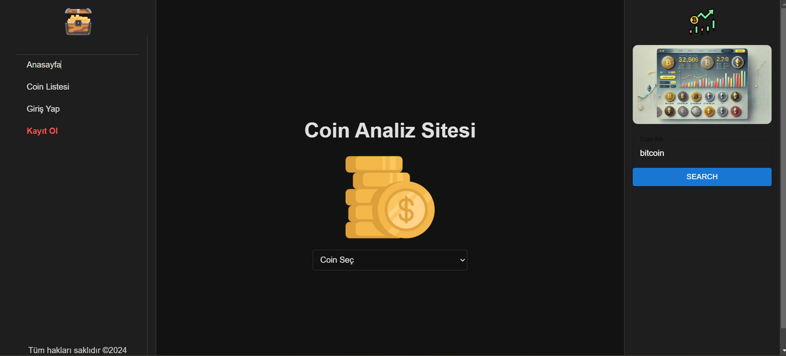
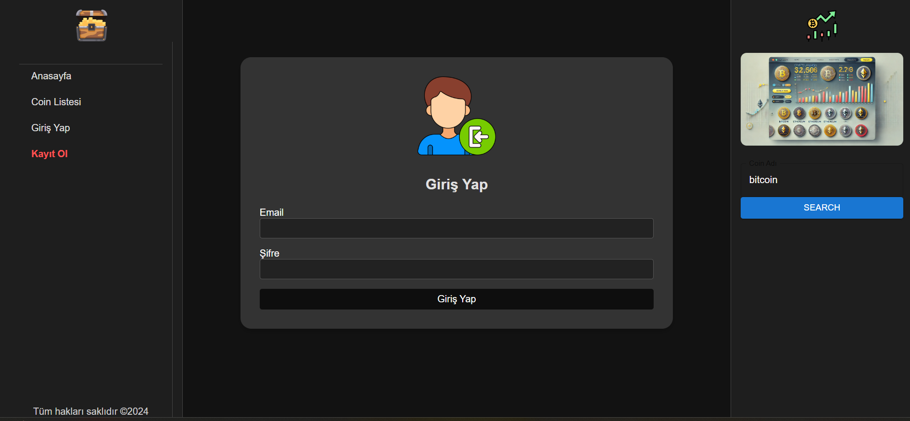
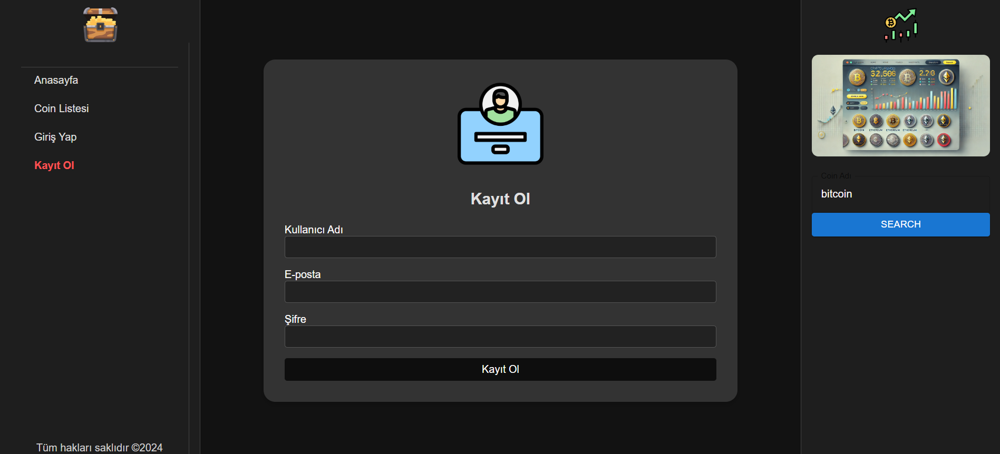
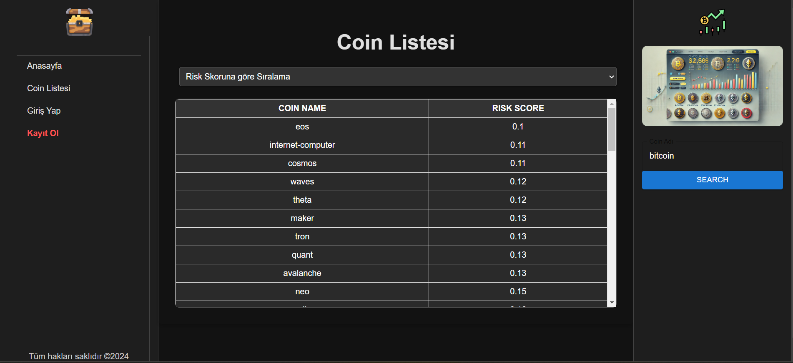
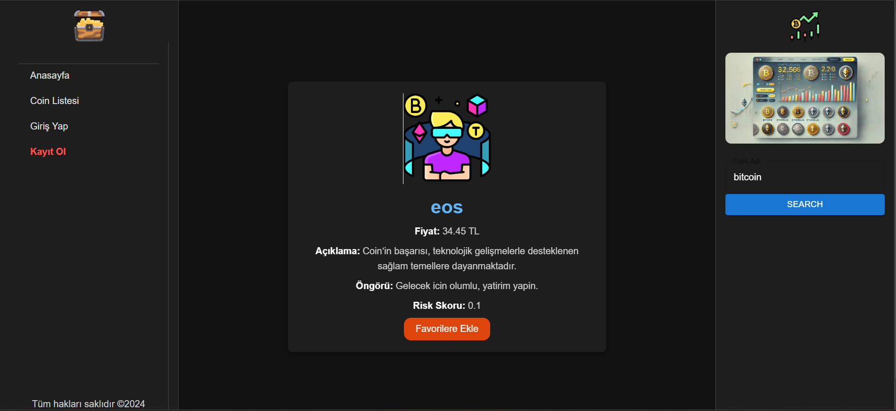
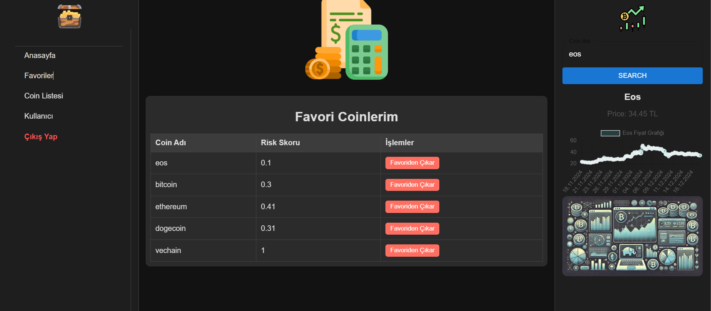
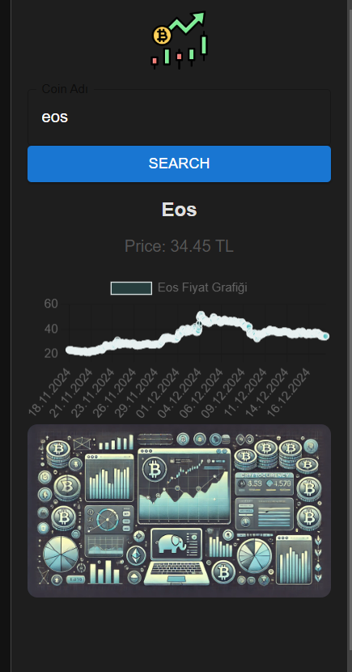
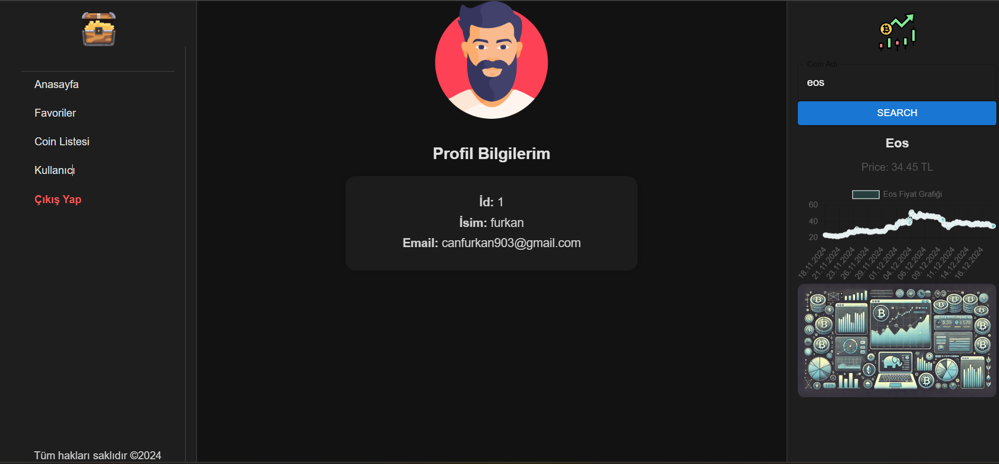

# Coin Analiz Projesi  

## Projenin Amacı  
Coin Analiz Projesi, kullanıcıların kripto paralara yatırım kararlarını desteklemek amacıyla geliştirilmiştir. Bu proje, kripto paralarla ilgili haberleri analiz ederek, her bir coin için duygu analizi gerçekleştirir ve bir risk skoru sunar. Ayrıca kullanıcıların coinleri favorilere ekleyip kendi portföylerini görüntüleyebilecekleri bir sistem sağlar.  

---

## Kullanılan Teknolojiler  

### Backend  
#### **Python**  
- Haberlerin duygu analizini gerçekleştirmek ve risk skorunu hesaplamak için kullanılacak.  
- **Kullanılan Kütüphaneler**:  
  - RandomForestClassifier  
  - LogisticRegression  
  - Pandas  
  - NLTK veya TextBlob gibi duygu analizi kütüphaneleri.  

#### **MySQL**  
- Risk skorları ve analiz sonuçları gibi verilerin saklanacağı ilişkisel veritabanı olarak kullanılacak.  

#### **Spring Boot**  
- API geliştirmek, kullanıcı doğrulama ve yetkilendirme işlemleri, favori coinlerin yönetimi gibi işlemleri gerçekleştirmek için kullanılacak.  
- **Özellikler**:  
  - Kullanıcı Girişi/Çıkışı  
  - Kullanıcı Kayıt
  - Kullanıcı bilgisi getirme
  - Favori Coinleri Ekleme/Çıkarma  
  - Favori Coinleri Görüntüleme
  - Coin görüntüleme/Fiyat bilgisi döndürme
  - Coinleri Normal & Risk skoruna göre sıralama
  - Spring Security ile security yönetimi 
---

### Frontend  
#### **React**  
- Kullanıcı dostu bir arayüz geliştirmek için kullanılacak.  
- **Özellikler**:  
  - Kullanıcı Girişi ve Kaydı  
  - Coin analiz sonuçlarını görüntüleme  
  - Favori coin listesini yönetme  
  - Risk skorlarını ve haber analizlerini görsel grafiklerle sunma  

---

### API  
#### **News API**  
- Coinlerle ilgili haberleri çekmek için kullanılacak.  

---

## Genel Akış  
1. **Haber Çekme**:  
   - News API ile coinlerle ilgili haberler toplanır.  

2. **Duygu Analizi ve Risk Skoru Hesaplama**:  
   - Python ile haberlerin duygu analizi yapılır.  
   - Her bir coin için olumlu/olumsuz analiz sonuçlarına göre bir risk skoru hesaplanır.  

3. **Veri Depolama**:  
   - Analiz sonuçları önce bir CSV dosyasına kaydedilir.  
   - Daha sonra MySQL veritabanına aktarılır.  

4. **Spring Boot API**:  
   - Verilere erişim ve yönetim için bir REST API geliştirilir.  
   - Kullanıcı girişi, çıkışı, favori coinleri ekleme/çıkarma işlemleri gerçekleştirilir.  

5. **Frontend (React)**:  
   - Kullanıcılar analiz sonuçlarını, risk skorlarını ve haberleri burada görüntüler.  
   - Kullanıcıların favori coinlerini ekleyip görüntüleyebilecekleri bir arayüz sunulur.  

---

## Projenin Özellikleri  
- **Giriş/Çıkış ve Kullanıcı Kayıt**:  
  Kullanıcılar hesap oluşturup giriş yapabilir.  

- **Haber Analizi**:  
  Haberlerden alınan duygu analizi sonuçlarıyla coinler için risk skorları oluşturulur.  

- **Favori Coin Yönetimi**:  
  Kullanıcılar favori coinlerini ekleyip kaldırabilir ve kendi portföylerini görebilir.  

- **Veri Görselleştirme**:  
  Risk skorları ve analiz sonuçları kullanıcı dostu grafiklerle sunulur.  

---

## Proje Durumu  
- [x] News API entegrasyonu  
- [x] Duygu analizi modülü  
- [x] Risk skoru hesaplama  
- [x] Spring Boot API geliştirme  
- [x] MySQL veritabanı bağlantısı  
- [x] Kullanıcı Giriş/Çıkış ve Kayıt  
- [x] Favori coin yönetimi  
- [x] React arayüz tasarımı  

---

## Ekran Görüntüleri  

### **Ana Ekran**  
  

### **Giriş Sayfası**  
  

### **Kayıt Sayfası**  
  

### **Coin Listesi**  
  

### **Coin Bilgi Ekranı**  
  

### **Favori Coinler**  
  

### **Risk Grafiği**  
  

### **Profil Sayfası**  
  

---

## Katkıda Bulunmak  
Bu projeye katkıda bulunmak için bir **pull request** oluşturabilir veya issue açabilirsiniz.  
